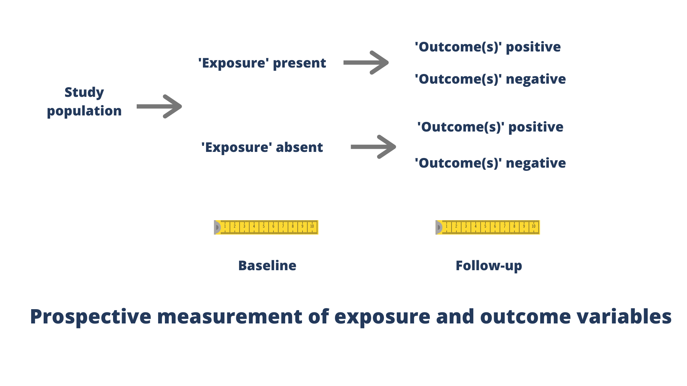
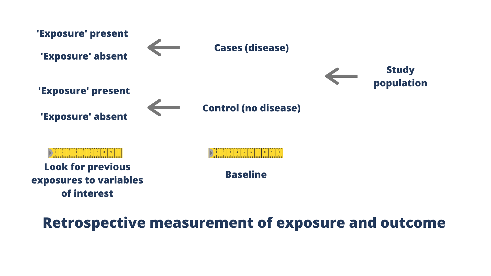

---
output:
  xaringan::moon_reader:
    self_contained: false
    lib_dir: libs
    css: xaringan-themer.css
    nature:
      ratio: 16:9
    includes:
      in_header: fa.html
---

class: center middle hide-count

## Cohort and case-control designs</em>
 
<i class="fas fa-forward fa-9x"></i> <i class="fad fa-history fa-9x"></i>

---

class: center middle hide-count inverse

## <i class="far fa-search-plus"></i> This is 'observational' research

---

class: center middle hide-count 

|Strengths | Limitations |
|--- | --- |
|Efficient way to collect large amounts of data when intervention/ randomization is not possible| No randomization|
|Does not require artificial provision of exposure|Rival explanations for results (e.g., confounding variables)|
|Treatments not withheld|Can require large sample sizes (e.g., cohort)|

---

class: center middle hide-count inverse

# <i class="fas fa-forward"></i> Cohort studies

---

class: center middle hide-count

## To determine relationship between **exposure** to specific situations/events/behaviours and **future** outcomes

---

class: left middle hide-count

---

class: center middle hide-count inverse

## <i class="fas fa-list"></i> Defining features of cohort studies

---

class: left middle hide-count
<h3>
<ul class="fa-ul">
<li><i class="fas fa-chevron-double-right"></i>Prospective</li>

<li><i class="fas fa-chevron-double-right"></i>Exposure occurs by participant choice or chance – not manipulated by investigator</li>

<li><i class="fas fa-chevron-double-right"></i>Identify 2 groups (exposed & not exposed) and follow forward in time </li>

<li><i class="fas fa-chevron-double-right"></i>Follow participants forward in time from exposure to compare development of outcome</li>
</ul>
</h3>
---

class: center middle hide-count inverse

# <i class="far fa-thumbs-up"></i> Advantages

---

class: left middle hide-count
<h3>
<ul class="fa-ul">
<li><i class="fas fa-chevron-double-right"></i>Manipulation not required</li>

<li><i class="fas fa-chevron-double-right"></i>Treatment not witheld (potential harm not imposed)</li>

<li><i class="fas fa-chevron-double-right"></i>Temporal relationship between hypothesized “cause” and “effect” retained</li>

<li><i class="fas fa-chevron-double-right"></i>Allows study of exposure-outcome relationships over longer term</li>

<li><i class="fas fa-chevron-double-right"></i>Can provide an assessment of incidence/prevalence/risk of outcome(s)</li>
</ul>
</h3>
---

class: center middle hide-count inverse

# <i class="far fa-thumbs-down"></i> Disadvantages
---

class: left middle hide-count
<h3>
<ul class="fa-ul">
<li><i class="fas fa-chevron-double-right"></i>Absence of randomization to groups (selection bias)</li>

<li><i class="fas fa-chevron-double-right"></i>Other (confounding) factors related to exposure may not be captured</li>

<li><i class="fas fa-chevron-double-right"></i>If effect of exposure is delayed, long follow-up period may be required</li>

<li><i class="fas fa-chevron-double-right"></i>Possible differences between those who leave and those who remain (differential loss to follow-up)</li>
</ul>
</h3>
---

class: center middle hide-count inverse

# <i class="fas fa-balance-scale-right"></i> Relative risk

---

class: left middle hide-count

## The ratio of the probability of an outcome occurring in an exposed group **compared to** the probability of an outcome occurring in an unexposed group

---

class: center middle hide-count

## (Probability of event in exposed group) 
 (Probability of event in non-exposed group)

---

class: center middle hide-count inverse

# <i class="fas fa-balance-scale-right"></i> Interpreting relative risk

---

class: left middle hide-count

| Result  |   Interpretation|
|---|---|
| RR = 1 | Incidence in the exposed group is the same as the unexposed group- no association; risk is the same for both groups|
| RR >1 | Incidence in the exposed group is greater than the incidence in the unexposed group, there is an increased risk or positive association |
| RR <1 | Incidence in the exposed group is lower than the incidence in the unexposed group, there is a decreased risk or negative association |

<h3> All the same rules apply for assessing imprecision (i.e. confidence intervals)</h3>

---

class: center middle hide-count inverse

# <i class="fad fa-history"></i> Case-control studies

---

class: center middle hide-count

## To determine relationship between **known outcome** and **previous exposure** to specific situations/events/behaviours

---

class: center middle hide-count

---

class: center middle hide-count inverse

## <i class="fas fa-list"></i> Defining features of case-control studies

---

class: left middle hide-count
<h3>
<ul class="fa-ul">
<li><i class="fas fa-chevron-double-right"></i>Retrospective</li>

<li><i class="fas fa-chevron-double-right"></i>Identify individuals with outcome of interest (cases)</li>

<li><i class="fas fa-chevron-double-right"></i>Identify similar individuals without outcome of interest (controls)</li>

<li><i class="fas fa-chevron-double-right"></i>Look back in time to compare exposure to specific situations/events/behaviours</li>

<li><i class="fas fa-chevron-double-right"></i>Exposure occurs by participant choice or chance – not manipulated by investigator</li>
</ul>
</h3>
---

class: center middle hide-count inverse

# <i class="far fa-thumbs-up"></i> Advantages

---

class: left middle hide-count
<h3>
<ul class="fa-ul">
<li><i class="fas fa-chevron-double-right"></i>Manipulation of exposure not required</li>

<li><i class="fas fa-chevron-double-right"></i>Treatment not withheld, potential harm not imposed</li>

<li><i class="fas fa-chevron-double-right"></i>Temporal relationship between hypothesized “cause” and “effect” retained</li>

<li><i class="fas fa-chevron-double-right"></i>More feasible for studying outcomes that occur rarely or with long latency period (e.g., cancer)</li>

<li><i class="fas fa-chevron-double-right"></i>May not cost as much due to retrospective design</li>
</ul>
</h3>
---

class: center middle hide-count inverse

# <i class="far fa-thumbs-down"></i> Disadvantages

---

class: left middle hide-count
<h3>
<ul class="fa-ul">
<li><i class="fas fa-chevron-double-right"></i>Absence of randomization to groups (selection bias)</li>

<li><i class="fas fa-chevron-double-right"></i>Other (confounding) factors related to outcome may not be captured </li>

<li><i class="fas fa-chevron-double-right"></i>No control over exposure</li>

<li><i class="fas fa-chevron-double-right"></i>Groups may be different with respect to reporting of past exposure (termed recall bias)</li>
</ul>
</h3>

---

class: center middle hide-count inverse

# <i class="fad fa-dice"></i> Odds ratio

---

class: left middle hide-count

## Represents the odds that an outcome will occur given a particular exposure, **compared to** the odds of the outcome occurring in the absence of that exposure

---

class: center middle hide-count inverse

# <i class="fad fa-dice"></i> Interpreting odds ratio

---

class: left middle hide-count

| Result  |   Interpretation|
|---|---|
| OR = 1 | exposure does not affect odds of disease |
| OR > 1 | exposure is associated with higher odds of disease (i.e. a 'positive' association between exposure and outcome) |
| OR < 1 | exposure is associated with lower odds of disease (i.e. a 'negative' association between exposure and outcome)|

<h3> All the same rules apply for assessing imprecision (i.e. confidence intervals)</h3>

---

class: center middle hide-count inverse

### <i class="fas fa-times-square"></i> Reducing bias in Cohort and Case-Control Studies

---

class: left middle hide-count

| Type of bias  | Explanation|   Cohort study | Case-Control Study |
|---|---| --- |---|
| Selection bias| Groups differ on prognostic factors (variables that are associated with the outcome)| Statistical adjustment for confounders (measure the variables and include them in the statistical model to produce an effect estimate that is 'adjusted' for the effect of the confounder)| Matching of cases and controls on confounders (e.g. age, sex)|
|Recall bias| Due to participant beliefs/awareness| Less of an issue due to prospective nature of data collection| Exposures selected that are more objective (to minimize recall bias) or don't require much participant recall|
|Detection bias| Bias in measurement of outcomes and exposures| Objective outcomes, blinding of outcome assessors| Clear definitions for 'cases' and blinding the assessor of exposures to case/control status|
|Attrition bias| Missing outcome data| <li>Incentives to keep participants in the study </li><li>Impute missing data</li>| Losing participants is not a big issue but data may be missing for exposures if relying on retrospective data|

---
class: center middle hide-count

## Cohort and case-control designs</em>
 
<i class="fas fa-forward fa-9x"></i> <i class="fad fa-history fa-9x"></i>
