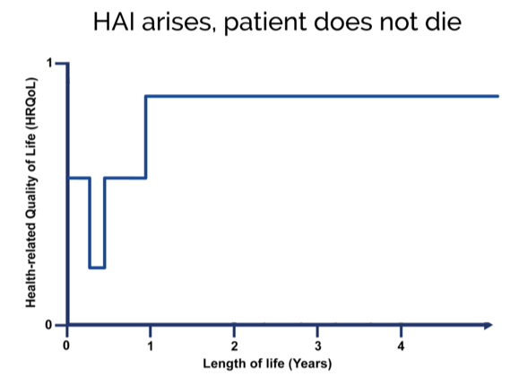
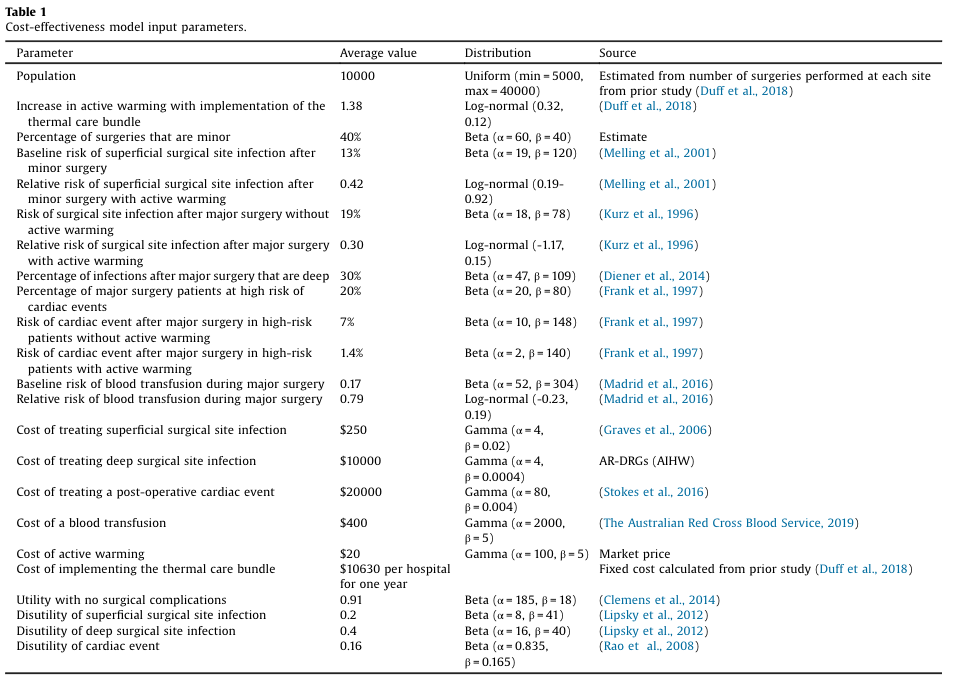

---
output:
  xaringan::moon_reader:
    self_contained: false
    lib_dir: libs
    css: xaringan-themer.css
    nature:
      ratio: 16:9
    includes:
      in_header: fa.html
    keep_md: true
---

```{r include=FALSE}
library(ggplot2)
```

class: center middle hide-count


# <strong>Economic evaluation</strong>
<br>
<i class="fas fa-money-check-edit-alt fa-10x"></i>
---

class: center middle hide-count inverse

## Why Are Economic Evaluations Important? 

---

class: center middle hide-count


## Determine if the benefits will be worth the health care resources


---

class: center middle hide-count


## Count up all the costs and all the benefits to make the decision

---

class: center middle hide-count inverse

## Types of economic evaluations

---

class: left middle hide-count

## <i class="fa fa-angle-double-right fa-lg"></i> Cost analysis

## <i class="fa fa-angle-double-right fa-lg"></i> Cost-effectiveness analysis

## <i class="fa fa-angle-double-right fa-lg"></i> Cost-utility analysis

## <i class="fa fa-angle-double-right fa-lg"></i> Cost-benefit analysis


---

class: center middle hide-count


<sub>Drummond, M.F., Sculpher, M.J., Torrance, G.W., O’Brien, B.J., Stoddart, G.L. (2005). Methods for the economic evaluation of health care programmes (3rd ed.). New York: Oxford University Press.</sub>

???

We will focus on the full economic evaluations
---

class: center middle hide-count inverse

# Cost-effectiveness analysis

---

class: center middle hide-count 

### Costs **and** consequences of **two (or more)** alternatives (i.e., treatments, interventions, programs)

???

Because both costs and consequences are measured, we need a particular approach to incorporate both of these into the one overall outcome for evaluation

---

class: center top hide-count

##  <i class="fad fa-percentage"></i> Incremental cost-effectiveness ratio


<h3> Calculate the additional cost <strong>per unit</strong> of health gain
</h3>
<br>

<blockquote>Henderson, J. W. (2015). Health economics and policy (6th ed.). Stamfort, CT: Centage Learning.  
</blockquote>

---

class: center middle hide-count

## Example ICER calculation


>**Interpretation**: the extra cost to gain one additional QALY (that is one year of perfect health) by using docetaxel instead of paclitaxel is £1,995.

<i class="fad fa-link"></i> [Implementing QALYs](http://citeseerx.ist.psu.edu/viewdoc/download?doi=10.1.1.577.2747&rep=rep1&type=pdf)

---

class: center middle hide-count 

## "...a way to quantify trade-offs between resources used and health outcomes achieved without having to value health outcomes in monetary terms"

>Henderson, J. W. (2015). Health economics and policy (6th ed.). Stamfort, CT: Centage Learning.  

---

class: center middle hide-count inverse

# Cost-utility analysis

---

class: left middle hide-count

## Specific type of CEA, where effectiveness is concerned with life expectancy and quality of life 

## QALYs calculated by using utility score to “weight” life expectancy gained according to quality of life spent during that time

---
class: center middle hide-count inverse

## Calculating QALYs
---

class: center middle hide-count

---

class: center middle hide-count


.left-pic[


]

.right-pic[


]
---

class: center middle hide-count


.left-pic[


]

.right-pic[


]
---

class: center middle hide-count


---

class: center middle hide-count

### <i class="fad fa-calculator"></i> Utility score of 0.6 for 10 years = `r 0.6*10` QALYs

### <i class="fad fa-calculator"></i> Utility score of 0.3 for 15 years = `r 0.3*15` QALYs


---

class: center middle hide-count inverse

# Addressing Parameter Uncertainty 
???

- Cost-effectiveness analyses are subject to sampling error just like any other study
---

class: center middle hide-count

### Estimates about the costs for the intervention and the benefits are drawn from a **sample** and we are interested in making a decision about adopting an intervention in the **population**

???

- Estimates about the costs for the intervention and the benefits are drawn from a sample of the population and we are interested in making a decision about adopting an intervention in the population
- Need a way to take that uncertainty into account

---

class: center middle hide-count

## Probabistic sensitivity analysis

???

- Most cost-effectiveness studies you will come across in the literature will use these types of methods so it's important to have an understanding of the approach and how to interpret the results
- Take you through an example of a cost-effectiveness analyses that I conducted

---

class: center middle hide-count inverse

# Example cost-utility analysis
---

class: center middle hide-count

<a href="https://www.sciencedirect.com/science/article/pii/S0020748919301142">
</a>

---
class: center middle hide-count

### Knowledge translation activities themselves require substantial resources and therefore can be very costly for a health service

---
class: center middle hide-count

### Determine if the strategies used to improve uptake of evidence into practice are likely to be of good value for their organization

---
class: left middle hide-count

### Knoweldge translation project aimed at implementing a bundle of interventions in surgical patients to reduce the risk of complications arising from inadvertent perioperative hypothermia was actually good value.

---

class: center middle hide-count inverse

## Background

---

class: center middle hide-count

### Active warming should be used peri-operatively to prevent surgical complications that are associated with high costs and reduced quality of life such as surgical site infections and bleeding

---

class: center middle hide-count

## Adherence is a problem

---

class: left middle hide-count

### <i class="fa fa-angle-double-right fa-lg"></i>  45% of surgical patients did not receive active warming when indicated [(Duff et al., 2014)](https://www.researchgate.net/profile/Jed_Duff/publication/282254362_Incidence_of_perioperative_inadvertent_hypothermia_and_compliance_with_evidence-based_recommendations_at_four_Australian_hospitals_A_retrospective_chart_audit/links/5731a50208ae08415e6b59da/Incidence-of-perioperative-inadvertent-hypothermia-and-compliance-with-evidence-based-recommendations-at-four-Australian-hospitals-A-retrospective-chart-audit.pdf)

### <i class="fa fa-angle-double-right fa-lg"></i> Less than 15% of a cohort of more than 3,000 surgical patients studied being warmed with electric heaters or blankets [(Yi et al., 2017)](https://doi.org/10.1371/journal.pone.0177221)

### <i class="fa fa-angle-double-right fa-lg"></i> 46% of all patients (n=50,689) admitted to an ICU after major elective surgery were hypothermic [(Karalapillai et al., 2013)](https://onlinelibrary.wiley.com/doi/full/10.1111/anae.12129).

---

class: center middle hide-count inverse

## Knowledge translation strategy

---

class: left middle hide-count

### Core team at each site led the implementation by: 

<i class="fa fa-angle-double-right fa-lg"></i> Accessing email and phone support from the research team when required

<i class="fa fa-angle-double-right fa-lg"></i> Attending workshops to learn about methods to utilise for local implementation

<i class="fa fa-angle-double-right fa-lg"></i> Using a structured local barrier identification and mitigation tool (Gurses et al., 2009)

<i class="fa fa-angle-double-right fa-lg"></i> Using Plan-Do-Study-Act cycles (which were taught at the workshops) to guide the actual implementation

### Is the added cost of these activities good value for an institution?


---
class: center middle hide-count

## Effects of the bundle were evaluated using a multi-site pre and post-implementation design

---
class: center middle hide-count


### Thermal Care Bundle increased adherence to clinical guideline recommendations, with active warming used for **15% more** patients in the post-implementation phase (95% CI = 5.4% to 23.2%).

---
class: center middle hide-count


### It cost **$10, 630 per hospital** to implement the Thermal Care Bundle

---

class: center middle hide-count inverse

## Probabilistic Cost-Effectiveness Analysis

---

class: center middle hide-count




---

class: center middle hide-count


---

class: left middle hide-count

### Used simulations to estimate the probabilty that different complications arising from perioperative hypothermia would occur in a hypothetical cohort of surgical patients, based on whether they received active warming or not. 

### We also modelled the costs associated with those complications and the costs associated with the actual knowledge translation strategy.

---

class: center top hide-count

## Model structure


---

class: center top hide-count


### <em>Assess gains in health relative to costs</em>

---

class: center top hide-count

## Just used the average


--
<h3><em> How certain are we about this decision?</em>
---

class: center top hide-count

## Simulate multiple versions of the anaalysis


---

class: center middle hide-count

.pull-left[

]

.pull-right[

<h2>
Logically
</h2>
If the probability adoption was cost-effective is 51%, <em>a rational decision maker would adopt</em>
<br><br><br>
If the probability adoption was <strong> not </strong> cost-effective is 51%, <em>a rational decision maker would <strong>not</strong> adopt</em>

]

---


class: left middle hide-count

### The costs and effects on quality of life of surgical complications associated with periopeartive hypothermia were derived from literature review and then modelled

### To quantify model uncertainty, 1000 Monte-Carlo (random) samples were drawn from probability distributions specified for all model parameters 

---

class: center top hide-count

## Population


.left-column[

```{r echo=FALSE, fig.align='left', fig.retina=8}
popminordist=rbeta(1000,60,40)
ggplot(data = NULL, aes(x=popminordist))+
  geom_density()+
  theme(plot.background = element_rect(fill = "#d3d7de"),
        panel.background = element_rect(fill = "#d3d7de"))+
   labs(x = "Percentage of minor surgeries at institution")
```
]

.right-column[
<table><thead class="valign-top"><tr class="rowsep-1"><th scope="col" class="align-left">Parameter</th><th scope="col" class="align-left">Average value</th><th scope="col" class="align-left">Distribution</th><th scope="col" class="align-left">Source</th></tr></thead><tbody><tr><th class="align-left" scope="row">Population</th><td class="align-left">10000</td><td class="align-left">Uniform (min&thinsp;=&thinsp;5000, max&thinsp;=&thinsp;40000)</td><td class="align-left">Estimated from number of surgeries performed at each site from prior study (<a name="bbib0040" href="#bib0040" class="workspace-trigger">Duff et al., 2018</a>)</td></tr><tr><th class="align-left" scope="row">Increase in active warming with implementation of the thermal care bundle</th><td class="align-left">1.38</td><td class="align-left">Log-normal (0.32, 0.12)</td><td class="align-left">(<a name="bbib0040" href="#bib0040" class="workspace-trigger">Duff et al., 2018</a>)</td></tr><tr><th class="align-left" scope="row">Percentage of surgeries that are minor</th><td class="align-left">60%</td><td class="align-left">Beta (α&thinsp;=&thinsp;60, β&thinsp;=&thinsp;40)</td><td class="align-left">Estimate</td></tr>

]
---

class: center top hide-count

## Infection

.left-column[

```{r echo=FALSE, fig.align='left', fig.retina=8}
riskinfection=rbeta(n=1000,19,(139-19))
ggplot(data = NULL, aes(x=riskinfection))+
  geom_density()+
  theme(plot.background = element_rect(fill = "#d3d7de"),
        panel.background = element_rect(fill = "#d3d7de"))+
   labs(x = "Baseline risk of infection in patients undergoing minor surgery")
```
]

.right-column[
<table><thead class="valign-top"><tr class="rowsep-1"><th scope="col" class="align-left">Parameter</th><th scope="col" class="align-left">Average value</th><th scope="col" class="align-left">Distribution</th><th scope="col" class="align-left">Source</th></tr></thead><tbody><tr><th class="align-left" scope="row">Baseline risk of superficial surgical site infection after minor surgery</th><td class="align-left">13%</td><td class="align-left">Beta (α&thinsp;=&thinsp;19, β&thinsp;=&thinsp;120)</td><td class="align-left">(<a name="bbib0100" href="#bib0100" class="workspace-trigger">Melling et al., 2001</a>)</td></tr><tr><th class="align-left" scope="row">Relative risk of superficial surgical site infection after minor surgery with active warming</th><td class="align-left">0.42</td><td class="align-left">Log-normal (0.19-0.92)</td><td class="align-left">(<a name="bbib0100" href="#bib0100" class="workspace-trigger">Melling et al., 2001</a>)</td></tr><tr><th class="align-left" scope="row">Risk of surgical site infection after major surgery without active warming</th><td class="align-left">19%</td><td class="align-left">Beta (α&thinsp;=&thinsp;18, β&thinsp;=&thinsp;78)</td><td class="align-left">(<a name="bbib0085" href="#bib0085" class="workspace-trigger">Kurz et al., 1996</a>)</td></tr><tr><th class="align-left" scope="row">Relative risk of surgical site infection after major surgery with active warming</th><td class="align-left">0.30</td><td class="align-left">Log-normal (-1.17, 0.15)</td><td class="align-left">(<a name="bbib0085" href="#bib0085" class="workspace-trigger">Kurz et al., 1996</a>)</td></tr><tr><th class="align-left" scope="row">Percentage of infections after major surgery that are deep</th><td class="align-left">30%</td><td class="align-left">Beta (α&thinsp;=&thinsp;47, β&thinsp;=&thinsp;109)</td><td class="align-left">(<a name="bbib0025" href="#bib0025" class="workspace-trigger">Diener et al., 2014</a>)</td></tr></tbody></table>

]

---

class: center top hide-count

### Cardiac events

<table><thead class="valign-top"><tr class="rowsep-1"><th scope="col" class="align-left">Parameter</th><th scope="col" class="align-left">Average value</th><th scope="col" class="align-left">Distribution</th><th scope="col" class="align-left">Source</th></tr></thead><tbody><tr><th class="align-left" scope="row">Percentage of major surgery patients at high risk of cardiac events</th><td class="align-left">20%</td><td class="align-left">Beta (α&thinsp;=&thinsp;20, β&thinsp;=&thinsp;80)</td><td class="align-left">(<a name="bbib0050" href="#bib0050" class="workspace-trigger">Frank et al., 1997</a>)</td></tr><tr><th class="align-left" scope="row">Risk of cardiac event after major surgery in high-risk patients without active warming</th><td class="align-left">7%</td><td class="align-left">Beta (α&thinsp;=&thinsp;10, β&thinsp;=&thinsp;148)</td><td class="align-left">(<a name="bbib0050" href="#bib0050" class="workspace-trigger">Frank et al., 1997</a>)</td></tr><tr><th class="align-left" scope="row">Risk of cardiac event after major surgery in high-risk patients with active warming</th><td class="align-left">1.4%</td><td class="align-left">Beta (α&thinsp;=&thinsp;2, β&thinsp;=&thinsp;140)</td><td class="align-left">(<a name="bbib0050" href="#bib0050" class="workspace-trigger">Frank et al., 1997</a>)</td></tr></tbody></table>

.pull-left[

```{r echo=FALSE, fig.align='left', fig.retina=8, fig.height=5}
cardiacbaseline=rbeta(1000,10,158-10)
ggplot(data = NULL, aes(x=cardiacbaseline))+
  geom_density()+
  theme(plot.background = element_rect(fill = "#d3d7de"),
        panel.background = element_rect(fill = "#d3d7de"))+
   labs(x = "Baseline risk of cardiac events")
```
]

.pull-right[

```{r echo=FALSE, fig.align='left', fig.retina=8, fig.height=5}
cardiacwarmed=rbeta(1000,2,142-2)
ggplot(data = NULL, aes(x=cardiacwarmed))+
  geom_density()+
  theme(plot.background = element_rect(fill = "#d3d7de"),
        panel.background = element_rect(fill = "#d3d7de"))+
   labs(x = "Risk of cardiac events with warming")
```
]
---

class: center top hide-count

## Blood transfusions

<table><thead class="valign-top"><tr class="rowsep-1"><th scope="col" class="align-left">Parameter</th><th scope="col" class="align-left">Average value</th><th scope="col" class="align-left">Distribution</th><th scope="col" class="align-left">Source</th></tr></thead><tbody><tr><th class="align-left" scope="row">Baseline risk of blood transfusion during major surgery</th><td class="align-left">0.17</td><td class="align-left">Beta (α&thinsp;=&thinsp;52, β&thinsp;=&thinsp;304)</td><td class="align-left">(<a name="bbib0095" href="#bib0095" class="workspace-trigger">Madrid et al., 2016</a>)</td></tr><tr><th class="align-left" scope="row">Relative risk of blood transfusion during major surgery</th><td class="align-left">0.79</td><td class="align-left">Log-normal (-0.23, 0.19)</td><td class="align-left">(<a name="bbib0095" href="#bib0095" class="workspace-trigger">Madrid et al., 2016</a>)</td></tr></tbody></table>

.pull-left[

```{r echo=FALSE, fig.align='left', fig.retina=8, fig.height=5}
risktransfusion=rbeta(1000,52,(304-52))
ggplot(data = NULL, aes(x=risktransfusion))+
  geom_density()+
  theme(plot.background = element_rect(fill = "#d3d7de"),
        panel.background = element_rect(fill = "#d3d7de"))+
   labs(x = "Baseline risk of blood transfusion")
```
]

.pull-right[

```{r echo=FALSE, fig.align='left', fig.retina=8, fig.height=5}
RRtransfusionwarmed=rlnorm(1000,log(0.79),(1.23-0.50)/3.92)
ggplot(data = NULL, aes(x=RRtransfusionwarmed))+
  geom_density()+
  theme(plot.background = element_rect(fill = "#d3d7de"),
        panel.background = element_rect(fill = "#d3d7de"))+
   labs(x = "Relative risk reduction in need for transfusion associated with warming")
```
]

---

class: center top hide-count

# Costs


<table><thead class="valign-top"><tr class="rowsep-1"><th scope="col" class="align-left">Parameter</th><th scope="col" class="align-left">Average value</th><th scope="col" class="align-left">Distribution</th><th scope="col" class="align-left">Source</th></tr></thead><tbody><tr><th class="align-left" scope="row">Cost of treating superficial surgical site infection</th><td class="align-left">$250</td><td class="align-left">Gamma (α&thinsp;=&thinsp;4, β&thinsp;=&thinsp;0.02)</td><td class="align-left">(<a name="bbib0055" href="#bib0055" class="workspace-trigger">Graves et al., 2006</a>)</td></tr><tr><th class="align-left" scope="row">Cost of treating deep surgical site infection</th><td class="align-left">$10000</td><td class="align-left">Gamma (α&thinsp;=&thinsp;4, β&thinsp;=&thinsp;0.0004)</td><td class="align-left">AR-DRGs (AIHW)</td></tr><tr><th class="align-left" scope="row">Cost of treating a post-operative cardiac event</th><td class="align-left">$20000</td><td class="align-left">Gamma (α&thinsp;=&thinsp;80, β&thinsp;=&thinsp;0.004)</td><td class="align-left">(<a name="bbib0135" href="#bib0135" class="workspace-trigger">Stokes et al., 2016</a>)</td></tr><tr><th class="align-left" scope="row">Cost of a blood transfusion</th><td class="align-left">$400</td><td class="align-left">Gamma (α&thinsp;=&thinsp;2000, β&thinsp;=&thinsp;5)</td><td class="align-left">(<a name="bbib0150" href="#bib0150" class="workspace-trigger">The Australian Red Cross Blood Service, 2019</a>)</td></tr><tr><th class="align-left" scope="row">Cost of active warming</th><td class="align-left">$20</td><td class="align-left">Gamma (α&thinsp;=&thinsp;100, β&thinsp;=&thinsp;5)</td><td class="align-left">Market price</td></tr><tr><th class="align-left" scope="row">Cost of implementing the thermal care bundle</th><td class="align-left">$10630 per hospital for one year</td><td class="align-left"></td><td class="align-left">Fixed cost calculated from prior study (<a name="bbib0040" href="#bib0040" class="workspace-trigger">Duff et al., 2018</a>)</td></tr></tbody></table>

### Cost of implementation was fixed amount calculated from the knowledge translation study

---

class: center top hide-count

# Utilities


<table><thead class="valign-top"><tr class="rowsep-1"><th scope="col" class="align-left">Parameter</th><th scope="col" class="align-left">Average value</th><th scope="col" class="align-left">Distribution</th><th scope="col" class="align-left">Source</th></tr></thead><tbody><tr><th class="align-left" scope="row">Utility with no surgical complications</th><td class="align-left">0.91</td><td class="align-left">Beta (α&thinsp;=&thinsp;185, β&thinsp;=&thinsp;18)</td><td class="align-left">(<a name="bbib0020" href="#bib0020" class="workspace-trigger">Clemens et al., 2014</a>)</td></tr><tr><th class="align-left" scope="row">Disutility of superficial surgical site infection</th><td class="align-left">0.2</td><td class="align-left">Beta (α&thinsp;=&thinsp;8, β&thinsp;=&thinsp;41)</td><td class="align-left">(<a name="bbib0090" href="#bib0090" class="workspace-trigger">Lipsky et al., 2012</a>)</td></tr><tr><th class="align-left" scope="row">Disutility of deep surgical site infection</th><td class="align-left">0.4</td><td class="align-left">Beta (α&thinsp;=&thinsp;16, β&thinsp;=&thinsp;40)</td><td class="align-left">(<a name="bbib0090" href="#bib0090" class="workspace-trigger">Lipsky et al., 2012</a>)</td></tr><tr><th class="align-left" scope="row">Disutility of cardiac event</th><td class="align-left">0.16</td><td class="align-left">Beta (α&thinsp;=&thinsp;0.835, β&thinsp;=&thinsp;0.165)</td><td class="align-left">(<a name="bbib0115" href="#bib0115" class="workspace-trigger">Rao et al., 2008</a>)</td></tr></tbody></table>

.pull-left[

```{r echo=FALSE, fig.align='left', fig.retina=8, fig.height=5}
nossiutility=rbeta(n=1000,185,18)
ggplot(data = NULL, aes(x=nossiutility))+
  geom_density()+
  theme(plot.background = element_rect(fill = "#d3d7de"),
        panel.background = element_rect(fill = "#d3d7de"))+
   labs(x = "Utility score for patients without complications")
```
]

.pull-right[

```{r echo=FALSE, fig.align='left', fig.retina=8, fig.height=5}
ssiutility=rbeta(n=1000, 8,41)
ggplot(data = NULL, aes(x=ssiutility))+
  geom_density()+
  theme(plot.background = element_rect(fill = "#d3d7de"),
        panel.background = element_rect(fill = "#d3d7de"))+
   labs(x = "Disutility associated with getting  superficial infection")
```
]
---

class: center middle hide-count inverse

## Results

---
class: center middle hide-count

### Probability that the thermal care bundle both reduces costs and increases QALYs was 90%


---

class: center middle hide-count


### <i class="fad fa-usd-circle"></i> Average cost reduction was $689,659 
95% credible intervals spanned from a $2,718,364 decrease in costs to $379,826 increase in costs

### <i class="fas fa-smile"></i> Average difference in quality-adjusted life years was 54 
95% credible intervals spanned from 0.4 less qalys to 176 more qalys


---

class: center middle hide-count inverse

## Limitations


---

class: left top hide-count

<center>
<h2> Study quality</h2>
</center>

### <i class="fa fa-angle-double-right fa-lg"></i> Moderate quality evidence for surgical site infection 

### <i class="fa fa-angle-double-right fa-lg"></i> Moderate quality evidence for risk of blood transfusion

### <i class="fa fa-angle-double-right fa-lg"></i> Low qulaity evidence for risk of cardiac events

<br><br>

<blockquote>
<sup>
<a href="cochranelibrary.com/cdsr/doi/10.1002/14651858.CD009016.pub2/abstract">Madrid, Eva, Gerard Urrutia, Marta Roqué i Figuls, Hector Pardo‐Hernandez, Juan Manuel Campos, Pilar Paniagua, Luz Maestre, and Pablo Alonso‐Coello. Active body surface warming systems for preventing complications caused by inadvertent perioperative hypothermia in adults. Cochrane Database of Systematic Reviews 4 (2016).</a>
</sup>
</blockquote>

---

class: center middle hide-count

### Should be considered applicable only to the demographic and setting of the evaluation study we conducted to estimate the success of the thermal care bundle

### May not generalise to other populations where considerably more resources would be required to exert a similar impact on increasing use of active warming

---

class: center middle hide-count

### Estimate of the effect of the thermal care bundle on increasing use of active warming was based on a non-randomised, pre-test post-test comparison

### Delaying implementation of the bundle to wait for more definitive evidence from a randomised controlled trial means the health system may be missing out on the cost-savings and health benefits projected by our model.
---

class: center middle hide-count inverse

# Conclusions

---

class: center middle hide-count 

### Likely that increasing use of active warming by implementing the thermal care bundle would generate cost-savings and improve the quality of life 
---

class: center middle hide-count 

### It would be good value for hospitals with similar characteristics to those included in our model to allocate the extra resources required for implementation.

### <i class="fad fa-link"></i> <a href="https://sedationapps.shinyapps.io/thermalbundleCEA">Individualized output for cost-effectiveness analyses</a></h3>

---

class: center middle hide-count


# <strong>Economic evaluation</strong>
<br>
<i class="fas fa-money-check-edit-alt fa-10x"></i>


