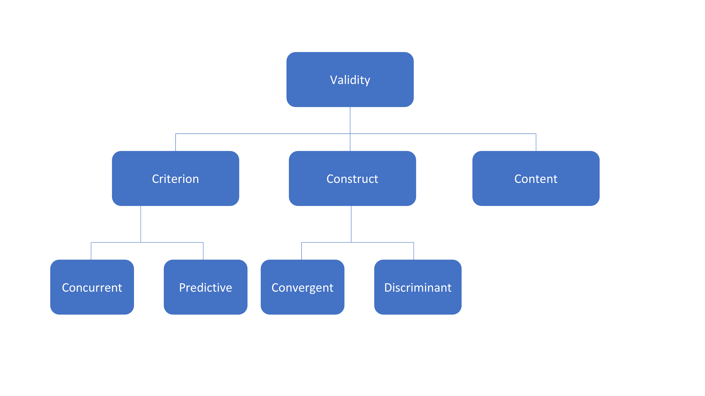

---
output:
  xaringan::moon_reader:
    seal: false
    lib_dir: libs
    css: [default, fonts.css, animate.css]
    includes:
      in_header: fa.html
    nature:
      slideNumberFormat: |
        <div class="progress-bar-container">
          <div class="progress-bar" style="width: calc(%current% / %total% * 100%);">
          </div>
        </div>
      ratio: '16:9'
---

```{r setup, include=FALSE}
options(htmltools.dir.version = FALSE)
library(icon)
library(emo)
```

class: center middle

# Introduction


???

Now that we've got the important concepts in measurment reliability covered, we can move on to validity.

---

class: left top

# Measurement validity



???
This is concerned with demonstrating evidence to support the claim that the instrument measures what it intends to measure. So how do we do this? There are several different ways that researchers can test the validity of an instrument. An easy way of remembering these may be thinking of the 3 C's of validity. They are Content, Construct and Criterion. First up, let's take a look at content validity.

---

class: left top

# Content validity

--

- How essential is each item to measuring the concept of interest?

--

- Content validity index (CVI): percent of expert judges who deemed that an item within an instrument was 'essential' to what's being measured


???

This referes to the extent to which each individual item within an instrument represents the construct of interest. In other words, studies conducted to evaluate the content validity of an instrument aim to answer the question, how essential is each item to measuring the concept of interest. When appraising research studies, you may come across the 'Content Validity Index'. This is a simple statistic, and it simply measures the percent of expert judges who deemed that an item within an instrument was 'essential' to what's being measured. 

What is important to note, is that although it is a good thing to evaluate content validity of the items included in a measurement in this way, it is by no means sufficient to only measure the content validty. So don't be surprised if some of the studies you come across in the literature don't actually report anything about the content validity of an instrument they're using. It's more common to report content validity results in a paper that is reporting on the development of an instrument. The additional testing to determine the strength of construct and criterion-related validity of an instrument is always going to be really vital. So let's move on to construct validity.


---

# Measuring 'burnout'

- Is the construct 'burnout' reflected in the survey items?
- How many 'dimensions' (or subscales) does it have?
- Do any items not reflect a dimension?

???

To understand construct validity well, it's good to get your head around what a construct is. 'Burnout' among registered nurses is an example of a construct. A construct, such as burnout, will consist of several dimensions. For example, the construct 'burnout' might consist of the dimensions "emotional exhaustion" and "physical exhaustion". This is why during the development of an indirect measurement instrument, researchers will typically conduct exploratory factor analysis to determine the number of dimensions of a construct that the instrument is measuring. Factor analysis also allows researcher to determine if any of the items in the instrument do not reflect one of those dimensions well, so they can be cut out. Another word for dimenstions that you'll come in the literature across is subscales. 

---

class: left, top
# Leadership


???

For the visual learners, let's say we have an instrument that measures the construct of nursing leadership and through factor analysis, we have determined that it contains four dimensions (or subscales). We can think of each item in the survey as a shot at the target of 'leadership'. If we have construct validity then we have shots fired at each part of the target. The shots in each quadrant make up the items contained within the subscales of the instrument. These subscales should be distinct enough to be different, but not so dissimilar that they appear to be measuring completely different things. In other words, the shots should be fired at different parts of the target, not at an entirely different target all together. That distinction is captured by the two forms of construct validity. These are called convergent and discriminant validity. 


---

class: left, top
.pull-left[
# Convergent validity

Measures of constructs that theoretically *should* be related to each other are, in fact, observed to be related to each other

# Divergent validity

Measures of constructs that theoretically *should not* be related to each other are, in fact, observed to not be related to each other 

>Gray et al. (2017)
]

???

There are a few ways to evaluate these types of construct validity. One common approach used is to compare results to other validated instruments. Let's take a look at how this works in practice in the next exercise.


