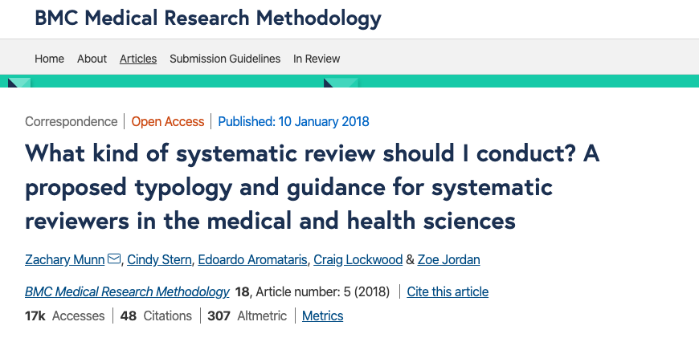
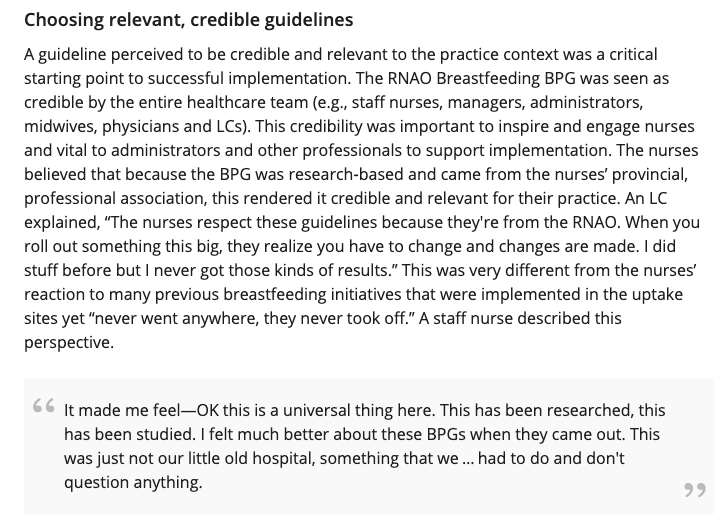

---
output:
  xaringan::moon_reader:
    self_contained: false
    lib_dir: libs
    css: xaringan-themer.css
    nature:
      ratio: 16:9
    includes:
      in_header: fa.html
---

class: center middle hide-count

## Alternative types of systematic reviews <i class="fas fa-search"></i>

---

class: center middle hide-count

---

class: left middle hide-count
<h3>
<ul class="fa-ul">
<li><i class="fas fa-chevron-double-right"></i> Meta-analysis of individual participant data</li>

<li><i class="fas fa-chevron-double-right"></i> Network meta-analysis</li>

<li><i class="fas fa-chevron-double-right"></i> Systematic reviews of systematic reviews (umbrella reviews)</li>

<li><i class="fas fa-chevron-double-right"></i> Systematic reviews of qualitative studies (meta-synthesis/meta-summary)</li>

<li><i class="fas fa-chevron-double-right"></i> Scoping review</li>

<li><i class="fas fa-chevron-double-right"></i> Narrative review/Non-systematic review</li>

</ul>
</h3>
---

class: left middle hide-count

<h3>
<ul class="fa-ul">
<li><i class="fas fa-not-equal"></i></i>Distinguish between systematic reviews of 'interventions' from other types of systematic reviews
</li>
</ul>
</h3>

---

class: center middle hide-count inverse

## <i class="fas fa-users-class"></i> Meta-analysis of individual participant data

---

class: left middle hide-count

> Original research data from the included studies are sought directly from the researchers and then re-analysed

<i class="fas fa-link"></i><a href="https://methods.cochrane.org/ipdma/about-ipd-meta-analyses"> About IPD meta-analyses (Cochrane)</a>
---

class: left middle hide-count

<h3>
<ul class="fa-ul">
<li><i class="fas fa-chevron-double-right"></i></i>Uncommon
</li>
<li><i class="fas fa-chevron-double-right"></i></i>Resource intensive
</li>
<li><i class="fas fa-chevron-double-right"></i></i>Challenging to source original data
</li>
<li><i class="fas fa-chevron-double-right"></i></i>Treated from RoB perspective the same as normal meta-analysis
</li>
</ul>
</h3>
---

class: center middle hide-count inverse

## <i class="fas fa-chart-network"></i> Network meta-analysis

---

class: left middle hide-count

>Examines all treatments for a given condition or disease and all the possible comparisons between them

<i class="fas fa-link"></i><a href="https://journals.sagepub.com/doi/10.1177/0962280207080643"> Salanti G , Higgins JP , Ades AE , et al . Evaluation of networks of randomized trials. Stat Methods Med Res 2008;17:279–301.</a>

---

class: center middle hide-count

## Ability to assess both direct and indirect evidence

<i class="fas fa-link"></i><a href="https://fn.bmj.com/content/104/1/F8?rss=1&utm_source=feedburner&utm_medium=feed&utm_campaign=Feed%253A%20bmj%252FqEtm%20%2528Archives%20of%20Disease%20in%20Childhood%20-%20Fetal%20and%20Neonatal%20Edition%20current%20issue%2529">Network meta-analysis explained</a>

---

class: left middle hide-count

<h3>
<ul class="fa-ul">
<li><i class="fas fa-chevron-double-right"></i></i>Uncommon
</li>
<li><i class="fas fa-chevron-double-right"></i></i>Treated from RoB perspective the same as normal meta-analysis
</li>
<li><i class="fas fa-chevron-double-right"></i></i>Likely requirement to downgrade from 'indirectness' in GRADE assessments for the certainty of evidence
</li>
</ul>
</h3>

---

class: center middle hide-count inverse

## <i class="fad fa-umbrella"></i> Systematic reviews of systematic reviews (Umbrella reviews)

---

class: left middle hide-count

> Synthesise information from all systematic reviews (meta-analyses) on a given topic

---

class: left middle hide-count

<h3>
<ul class="fa-ul">
<li><i class="fas fa-chevron-double-right"></i></i>Quite common for their to be multiple systematic reviews on the exact same topic</li>
<li><i class="fas fa-chevron-double-right"></i></i>Appraising the quality of those systematic reviews is important</li>
<li><i class="fas fa-chevron-double-right"></i></i>Same methods as normal systematic review except the 'studies' included are systematic reviews
</li>
<li><i class="fas fa-chevron-double-right"></i></i>May use the AMSTAR tool to assess the quality of the included systematic reviews
</li>
</ul>
</h3>
---

class: center middle hide-count

### <i class="fas fa-link"></i> <a href="https://journals.sagepub.com/doi/full/10.1177/1357633X13503427">Not all systematic reviews are systematic: a meta-review of the quality of systematic reviews for non-invasive remote monitoring in heart failure</a>

---

class: center middle hide-count
### <i class="fas fa-link"></i> <a href="https://link.springer.com/article/10.1186/s12885-015-1407-6">The prevention, detection and management of cancer treatment-induced cardiotoxicity: a meta-review</a>

---

class: center middle hide-count inverse

# <i class="fas fa-telescope"></i> Scoping reviews

---

class: left middle hide-count

>Determine the scope or coverage of a body of literature on a given topic and give clear indication of the volume of literature and studies available

<i class="fas fa-link"></i><a href="https://bmcmedresmethodol.biomedcentral.com/articles/10.1186/s12874-018-0611-x"> Systematic review or scoping review? Guidance for authors when choosing between a systematic or scoping review approach</a>

---

class: left middle hide-count

<h3>
<ul class="fa-ul">
<li><i class="fas fa-chevron-double-right"></i></i>To identify the types of available evidence in a given field</li>
<li><i class="fas fa-chevron-double-right"></i></i>To clarify key concepts/ definitions in the literature</li>
<li><i class="fas fa-chevron-double-right"></i></i>To examine how research is conducted on a certain topic or field
</li>
<li><i class="fas fa-chevron-double-right"></i></i>To identify key characteristics or factors related to a concept
</li>
<li><i class="fas fa-chevron-double-right"></i></i>
To identify and analyse knowledge gaps</li>
</ul>
</h3>

<i class="fas fa-link"></i><a href="https://bmcmedresmethodol.biomedcentral.com/articles/10.1186/s12874-018-0611-x"> Systematic review or scoping review? Guidance for authors when choosing between a systematic or scoping review approach</a>

---

class: left middle hide-count

## Can't be used to assess the 'effectiveness' of interventions

---

class: center middle hide-count inverse

# <i class="fad fa-book-reader"></i> Narrative reviews (non-systematic)

---

class: center middle hide-count

>Provide interpretation and critique; their key contribution is deepening understanding

<i class="fas fa-link"></i><a href="https://onlinelibrary.wiley.com/doi/full/10.1111/eci.12931"> Time to challenge the spurious hierarchy of systematic over narrative reviews?</a>

---

class: left middle hide-count

<h3>
<ul class="fa-ul">
<li><i class="fas fa-chevron-double-right"></i></i>Trend towards preference for systematic over narrative reviews in the contemporary literature in healthcare</li>
<li><i class="fas fa-chevron-double-right"></i></i>Serve different purposes and are complementary</li>
</ul>
</h3>

<i class="fas fa-link"></i><a href="https://onlinelibrary.wiley.com/doi/full/10.1111/eci.12931"> Time to challenge the spurious hierarchy of systematic over narrative reviews?</a>
---

class: center middle hide-count inverse

# Qualitative meta-synthesis

---

class: center middle hide-count

>A complete study that involves rigorously examining and interpreting the <strong>findings</strong> (versus the raw data) of a number of qualitative research studies using qualitative methods

Finfgeld, 2003

---

class: center middle hide-count

## Example of findings

<i class="fas fa-link"></i><a href="https://sigmapubs-onlinelibrary-wiley-com.myaccess.library.utoronto.ca/doi/full/10.1111/j.1741-6787.2012.00259.x"> Supporting the Uptake of Nursing Guidelines: What You Really Need to Know to Move Nursing Guidelines into Practice</a>

---
class: center middle hide-count

>Produce a new and integrative interpretation of findings that is more substantive than those resulting from individual investigations

Finfgeld, 2003

---
class: left top hide-count

<h1> Meta-synthesis<h1>

| Benefits | Weaknesses |
|---|---|
|Make sense of results of large numbers of studies, conflicting results|Complex & time consuming |
| Generate more comprehensive, relevant theory that can be applied more broadly | No one methodology for conducting a meta-synthesis or appraising studies|
|Complement quantitative systematic reviews by providing explanatory information | Balancing methodological rigor of each study with the risk of excluding studies that may provide valuable information |
|Provide guidance in implementing interventions and developing programs (e.g. practice guidelines, etc.)| Risk of taking information out of context when combining studies or significance of the context may be diminished |

---
class: center middle hide-count

## Alternative types of systematic reviews <i class="fas fa-search"></i>
