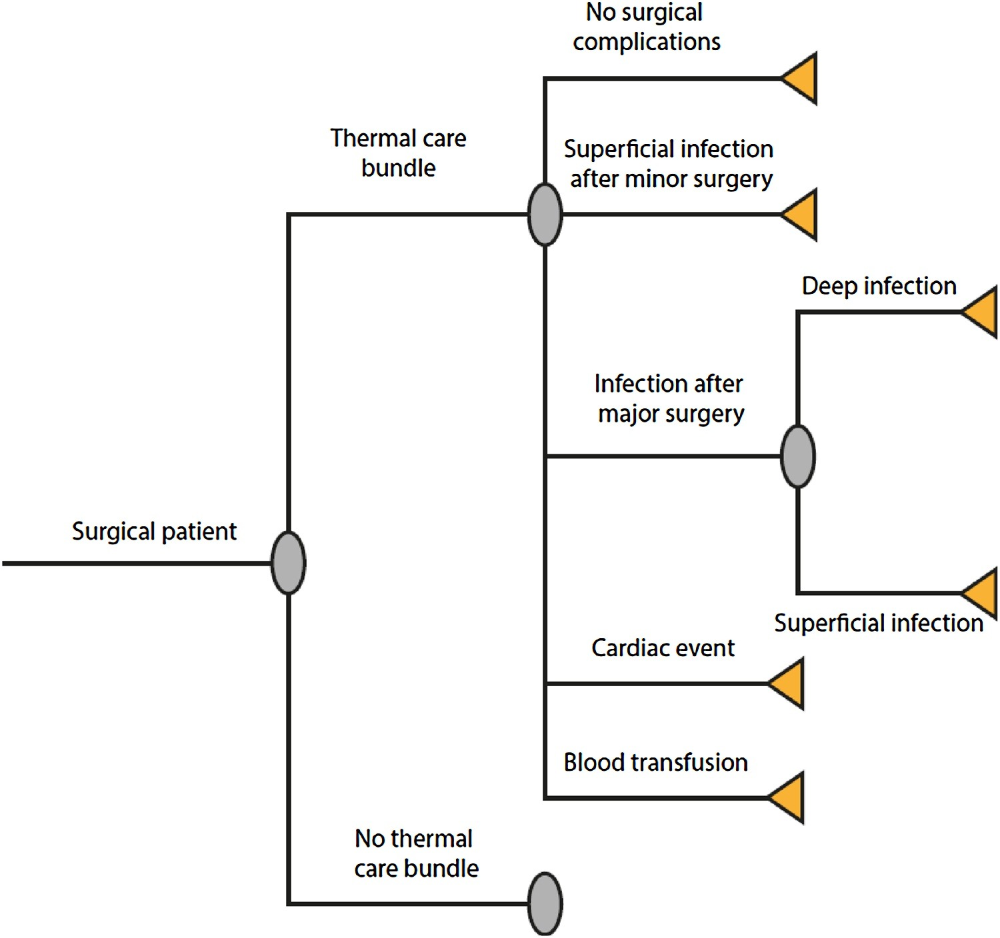

---
output:
  xaringan::moon_reader:
    seal: false
    lib_dir: libs
    css: [default, fonts.css, animate.css]
    nature:
      slideNumberFormat: |
        <div class="progress-bar-container">
          <div class="progress-bar" style="width: calc(%current% / %total% * 100%);">
          </div>
        </div>
      ratio: '16:9'
---

```{r setup, include=FALSE}
options(htmltools.dir.version = FALSE)
library(icon)
library(emo)
```

class: center middle

# Introduction


???

We really shouldn't forget that knowledge translation activities themselves require substantial resources and therefore can be very costly for a health service. For that reason, it is really vital for health service leaders and administrators to determine if the strategies used to improve uptake of evidence into practice (<a href="https://implementationscience.biomedcentral.com/articles/10.1186/s13012-014-0168-y">Hoomans and Severens, 2014</a>) are likely to be of good value. The changes in costs mainly arise from the resources needed for the implementation strategy and also due to the changes in service delivery costs in response to the implementation. 


---


# Thermal care bundle

???

One of my recent research projects was able to show that a knoweldge translation project aimed at improving the use of active warming in surgical patients to reduce the risk of complications arising from inadvertent perioperative hypothermia was actually good value. 


---

class: left, top

# The knowledge translation strategy


???

The focus was on implementing the National Institute for Health and Clinical Excellence guideline on preventing perioperative hypothermia and quite an intense and engaging knowledge translation strategy.  The model involved formation of a core team at each site who lead the implementation by: 

1) accessing email and phone support from the research team when required; 

2) attending workshops to learn about methods to utilise for local implementation; 

3) using a structured local barrier identification and mitigation tool (Gurses et al., 2009); and 

4) using Plan-Do-Study-Act cycles (which were taught at the workshops). 


---

class: left, top

# Effectiveness of the knowledge translation strategy


???

The effects of the bundle were evaluated using a multi-site pre and post-implementation design (Duff et al., 2018). The primary finding of this study was that implementing the bundle into practice resulted in increased use of active warming (difference 14.3%; 95% CI=5.5%–23.2%).


---

class: left, top

# Cost-effectiveness

.pull-left[



]


???

To determine if the knowledge translation strategy was not only effective at changing clinician's behaviour but also whether it is good value for an organisation we conducted what is called a 'probabilistic cost-effectiveess analysis'. What that basically means is that we used simulations to estimate the probabilty that different complications arising from perioperative hypothermia would occur in a hypothetical cohort of surgical patients, based on whether they received active warming or not, and also the costs associated with those complications and the costs associated with the actual knowledge translation strategy. 

---


class: left, top


.pull-left[


]

???

And what we found, is that it would be good value for a health care service to allocate the extra resources required for the knowledge translation activities to improve use of active warming, because it would be highly likely that this course of action would generate cost-savings for the health care system and also improve quality of life for patients undergoing surgery. You'll learn more about cost-effectiveness analyses next semester in 1127, but what the information in this cost-effectiveness plane is telling us, is that in about 90% of the simulations, applying the knowledge translation activities resulted in both a reduction in costs and improved quality of life. 

---


class: center, middle


How can this information be applied locally

???

And finally, we also developed a web application that healthcare leaders and administrators who are responsible to making decisions about resource allocation can use to estimate the probability that implementing this knowledge translation strategy would be cost-effective at their hospital. On the application, the decision-makers first input information specific to their institution. In response, individualised output including a cost-effectiveness plane, incremental net benefit and estimates of the differences in costs and quality-adjusted life years between decisions to either adopt or not adopt the knowledge translation strategy is produced to assist their decision making. In the next section is a working version of the app if you want to try it out.


